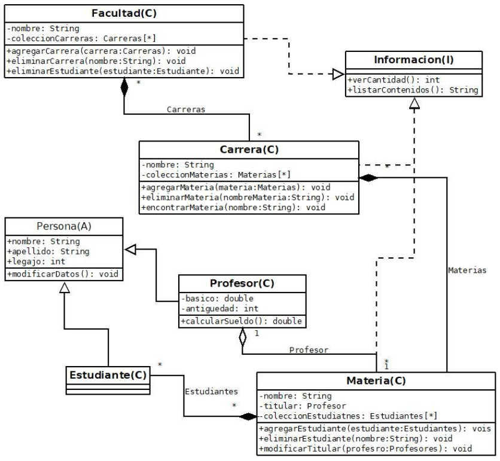

# TRABAJO PRÁCTICO: LA FACULTAD

Desarrollar un programa utilizando código Java que permita estructurar la administración de la facultad. El programa
deberá cumplir como mínimo con puntos debajo del diagrama. Tanto el diagrama como los puntos bajo el mismo deben ser
cumplidos para que se obtenga la nota máxima.

## DIAGRAMA

REQUERIMIENTOS

1. Agregar Carreras a una Facultad.

2. Eliminar Carreras de la facultad.

3. Eliminar Estudiantes de una facultad implica que se elimine el estudiante de cada una de las materias a las cuales se inscribió.

4. Agregar materias a una Carrera.

5. Eliminar materias a una Carrera.

6. Encontrar materias de una carrera en particular indicando el nombre de la materia. Si la materia existe nos deberá preguntar si deseamos eliminar.

7. Agregar Estudiantes a una Materia.

8. Eliminar Estudiante de una Materia.

9. Modificar el Profesor de la materia.

10. Las clases Estudiantes y Profesores descienden de la clase abstracta Personas.

11. El método calcularSueldo() de la clase Profesores calcula el sueldo sumando un 10% al básico por cada año de antiguedad.

12. El método listarContenidos() de la interface Información lista los elementos de la clase contenida, es decir que de la clase Facultad se listará las Carreras, de la clase Carreras las materias, etc. Siempre en orden alfabético.

13. El método verCantidad() de la interface Información muestra la cantidad de elementos que contiene, es decir que en el caso de la clase Carreras, devolverá la cantidad de materias que posee, en el caso de la clase Materias, la cantidad de estudiantes que tienen, etc.

14. Los constructores de todas las clases deben inicializar o cargar cada uno de los atributos que posee.

15. Todas las clases deben tener los métodos toString() para ver todos los datos de la clase y los métodos geters y seter por cada una de sus atributos.

16. Todos los lugares que signifiquen el ingreso de datos deberán establecer controles por posibles ingresos erróneos de datos. 