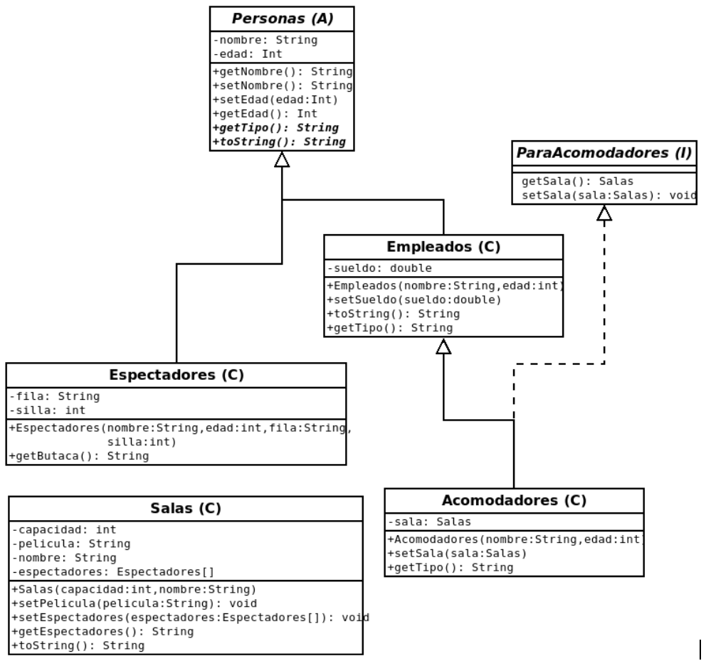

RESOLVER:

Realice un programa que permita la gestión de salas de cine, los espectadores de cada sala, los empleados del cine y los acomodadores asignados a una sala.

El programa deberá cumplir con las siguientes funcionalidades:

1. Una sala de cine debe contener la capacidad de la sala, la película que se proyecta en la misma, el nombre de la sala y el listado de espectadores asignados a la misma.

2. Las Salas no deben permitir la asignación de una lista de Espectadores superior a su capacidad

3. Se debe poder listar los espectadores de una sala, pero en caso de que no haya sido asignada se debe capturar el error emitiendo el mensaje "SIN ESPECTADORES CARGADOS".

4. El Programa debe por lo menos una clase abstracta Personas de la cual hereden Espectadores y Empleados:

5. La clase Personas deberá tener por lo menos dos método abstractos:

    1. Uno que permitirá ver si la persona es un Espectador, un Acomodador o un Empleado dependiendo de qué clase sea.

    2. Uno que permitirá visualizar todos los datos de la persona.

6. Los Espectadores además de sus datos personales deben estar asignados a una butaca definida por la Fila (una letra) y la Silla (un entero).

7. La clase Empleados deberá contener el Sueldo que cobra el empleado y permitir su posterior modificación.

8. El programa contendrá una clase Acomodadores que heredará de la clase Empleados e implementará la interfaz ParaAcomodadores.

9. A los Acomodadores se les podrá designar una sala o modificar la sala asignada.

10. La interfaz ParaAcomodadores deberá permitir la asignación y modificación de una sala a un acomodador.

11. El programa debe tener una clase principal llamada Cine en donde se deben realizar las siguientes operaciones:

    1. Cargar espectadores pidiendo los nombre, edad, fila y silla al usuario por medio de la consola. En caso de que el usuario ingrese letras en lugar de números donde no corresponda el programa debe finalizar con el error: "ERROR EN EL INGRESO DE DATOS".

    2. Por medio del código crear una sala con capacidad para 3 personas llamada “Sala 01” en donde se proyecte la película “Joker”.

    3. Asignar a la sala los espectadores cargados.

    4. Imprimir la lista de espectadores que se encuentran asignado a la sala.

    5. Crear un acomodador por medio del código.

    6. Asignar a dicho Acomodador la sala creada anteriormente.

    7. Asignar un sueldo de $50.000 al Acomodador.

    8. Mostrar los datos del Acomodador en la consola.

    9. Crear un Empleado.

    10. Mostrar los datos del Empleado.

12. Todas las clases instanciables del programa deben tener los métodos geters, seters para ingresar o visualizar datos necesarios para los procesos solicitados y el método toString que mostrará todos los datos relevantes de la clase.
